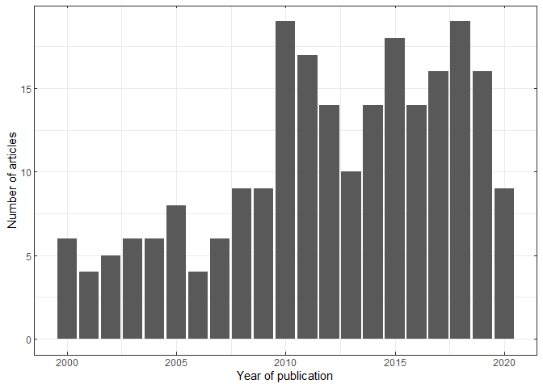

Occurrence of human infection with Salmonella Typhi in sub-Saharan
Africa
================
2023-07-24

### Source the util.R file and load packages

``` r
source("R/util.R") # this has ggplot theme, theme_map() 
library(tidyverse) # dplyr and ggplot2 packages are used
library(data.table) # fread function
library(raster) # we sometimes added the pkg name to the command for clarity
```

#### Figure 2A

Plot the frequency of publications by country and year

``` r
d <- fread("data/occ_data_20221025.csv")
d %>% 
  distinct(STUDY_INFO, .keep_all = TRUE) %>% 
  filter(YEAR_PUBLICATION >= 2000) %>%
  group_by(YEAR_PUBLICATION) %>%
  summarise(n=n()) -> cnt

p <- ggplot(cnt, aes(YEAR_PUBLICATION, n)) + 
  geom_point() + 
  geom_line() + 
  theme_bw() +
  theme(axis.ticks.length=unit(-2.75, "pt"))+
  scale_x_continuous(sec.axis = dup_axis()) +
  scale_y_continuous(sec.axis = dup_axis()) +
  theme(axis.text.x.top = element_blank(),
        axis.text.y.right = element_blank(),
        axis.title.x.top = element_blank(),
        axis.title.y.right = element_blank()) +
  labs(x = "Year of publication", y = "Number of articles")

p
```

<!-- -->

``` r
# ggsave(paste0("plots/study_freq_yr_", tstamp(), ".png"), p, 
#        width = 3.4, height = 2.7, units="in") 
```

#### Figure 2B

``` r
d %>% 
  group_by(COUNTRY, YEAR_PUBLICATION) %>%
  summarize(count=n()) -> d_co_yr

d %>%
  group_by(YEAR_PUBLICATION) %>%
  summarize(count = n()) -> d_tot

d_tot$COUNTRY <- "Total"
d_co_yr <- bind_rows(d_co_yr, d_tot)
cntry_ordered <- unique(d_co_yr$COUNTRY)
d_co_yr$COUNTRY <- factor(d_co_yr$COUNTRY, levels = rev(cntry_ordered))

cntry_labels <- cntry_ordered
cntry_labels[6] <- "CAR" # abbreviation for better displaying
cntry_labels[25] <- "Tanzania" # abbreviation for better displaying

p <- ggplot(data = d_co_yr) + 
  geom_point(aes(x = YEAR_PUBLICATION, y = COUNTRY, size = count)) +
  scale_size_continuous(limits = c(1, 50)) +
  scale_x_continuous(breaks = seq(2000, 2020, by=5), limits = c(2000, 2020)) +
  scale_y_discrete(breaks = cntry_ordered, labels = cntry_labels) + 
  labs(x="Year of publication", y = NULL, size="No. of reports" ) +
  theme_bw() + 
  theme(axis.ticks.length=unit(-2.75, "pt"), 
        legend.position = "bottom")
p
```

<!-- -->

``` r
# fac <- 1.8
# ggsave(paste0("plots/study_freq_yr_cntry_", tstamp(), ".png"), p, 
#        width = 3.4*fac, height = 2.7*fac, units="in") 
```

### Figure 3

Plot the grid cells of typhoid occurrence on the map

``` r
rst <- readRDS("data/elevation_20km_africa.rds")
afss <- readRDS("data/africa_sub_Sahara_adm0_shp.rds")

dculture <- d[grepl("culture", DIAGNOSTIC_METHOD_SUMMARY, ignore.case = TRUE)]
dother <-  d[!grepl("culture", DIAGNOSTIC_METHOD_SUMMARY, ignore.case = TRUE)]

rst <- mask(rst, afss)
rst <- setValues(rst, 0)
# culture-based occurrence
dculture %>% 
  filter(!is.na(LONGITUDE)) %>% 
  distinct(LONGITUDE, .keep_all = TRUE) -> dculture2

# occurrence matrix
occmat <- data.frame(X = as.double(dculture2$LONGITUDE),
                     Y = as.double(dculture2$LATITUDE))
occmat <- occmat[!is.na(occmat$X) & !is.na(occmat$Y), ]
# set the value to 1 for the grid cell of culture-based occurrence
for (i in 1:nrow(occmat)){
  cells <- raster::extract(rst, occmat[i,], df=TRUE, cellnumbers=TRUE)
  raster::values(rst)[unlist(cells$cell)] <- 1 
}

dother %>%
  mutate(LONGITUDE=as.double(LONGITUDE), LATITUDE=as.double(LATITUDE)) %>%
  filter(!is.na(LONGITUDE) & !is.na(LATITUDE)) %>% 
  distinct(LONGITUDE, .keep_all = TRUE) -> dother2

occmat2 <- data.frame(X = dother2$LONGITUDE, Y = dother2$LATITUDE)
occmat2 <- occmat2[!is.na(occmat2$X) & !is.na(occmat2$Y), ]
# set the value to 2 for the grid cells of non-culture-based occurrence
for (i in 1:nrow(occmat2)){
  cells <- raster::extract(rst, occmat2[i,], df = TRUE, cellnumbers = TRUE)
  values(rst)[unlist(cells$cell)] <- 2 
}

rst <- mask(rst, afss)
rpts <- rasterToPoints(rst)
rptsdf <- as.data.frame(rpts)
colnames(rptsdf) <- c("lon", "lat", "occ")
rptsdf$occ <- as.factor(rptsdf$occ)

p <- ggplot(rptsdf) +
  geom_raster(aes(lon, lat, fill=occ)) +
  scale_fill_manual(values=c("grey95", "darkred", "steelblue"), guide="none") +
  geom_polygon(data = afss, aes(long, lat, group = group), 
               fill = NA, inherit.aes = FALSE) +
  geom_path(data = afss, aes(long, lat, group = group),
            color = "black", inherit.aes = FALSE) +
  coord_equal() + 
  theme_map() + 
  theme(legend.title = element_text(size=12), 
        legend.text = element_text(size=12))

p
```

<!-- -->

``` r
# ggsave(paste0("figs/occ_grids_", tstamp(), ".png"), p, width=7.7, height=7.3, units="in")
```
